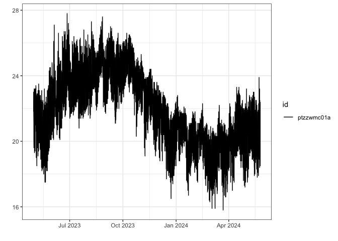

<!-- README.md is generated from README.Rmd. Please edit that file -->

# envlogger

<!-- badges: start -->
<!-- badges: end -->

Functions to handle EnvLogger data, from reading, processing and
plotting.  
If data conforms to the CCTBON naming scheme, additional functionalities
are available.

## Installation

You can install the development version of **envlogger** from
[GitHub](https://github.com/) with:

``` r
# install.packages("devtools")
devtools::install_github("ruiseabra/envlogger")
```

## Load envlogger

``` r
library(envlogger)
```

## read

``` r
# here we use the package's example data
READ_ENV(env_example("nozzz"), just_rep = TRUE)
#> # A tibble: 4 × 9
#>   id         serials data     overlap t0         t1           min   max pressure
#>   <chr>      <chr>   <list>   <lgl>   <date>     <date>     <dbl> <dbl> <lgl>   
#> 1 nozzzmc01a 0425 e… <tibble> FALSE   2023-09-11 2023-09-11  -1.8  14   FALSE   
#> 2 nozzzmc02a 04da 2… <tibble> FALSE   2023-09-11 2023-09-11  -2.2  15.4 FALSE   
#> 3 nozzzmh01a 04fd 0… <tibble> FALSE   2023-09-11 2023-09-11  -3.7  38.8 FALSE   
#> 4 nozzzmh02a 04a5 b… <tibble> FALSE   2023-09-11 2023-09-11  -4.1  38.8 FALSE
```

## cctbon

If the dataset being read conforms to CCTBON guidelines, especially
regarding to the logger naming scheme, additional information can be
extraceted.

``` r
# here we use the package's example data
cctbon_id(READ_ENV(env_example("nozzz"), just_rep = TRUE))
#> # A tibble: 4 × 15
#>   sh    micro lvl   exp   mic   rep   id     serials data     overlap t0        
#>   <chr> <chr> <fct> <fct> <chr> <chr> <chr>  <chr>   <list>   <lgl>   <date>    
#> 1 nozzz mc01  m     c     mc    01    nozzz… 0425 e… <tibble> FALSE   2023-09-11
#> 2 nozzz mc02  m     c     mc    02    nozzz… 04da 2… <tibble> FALSE   2023-09-11
#> 3 nozzz mh01  m     h     mh    01    nozzz… 04fd 0… <tibble> FALSE   2023-09-11
#> 4 nozzz mh02  m     h     mh    02    nozzz… 04a5 b… <tibble> FALSE   2023-09-11
#> # ℹ 4 more variables: t1 <date>, min <dbl>, max <dbl>, pressure <lgl>
```

## plot

Envlogger data can be visualized very quickly with simple commands.

``` r
plot_env(
  cctbon_data = env_example("ptzzw", no_logs = TRUE)[1], 
  by_day = FALSE
  )
```



When plotting complex datasets, `plot_env()` offers a great deal of
customization through the use of several function parameters.

``` r
plot_env(
  cctbon_data = env_example(c("nozzz", "ptzzy", "ptzzw")),
  by_micro  = TRUE,
  col_by    = "sh",
  facet_row = "exp",
  ribbon    = TRUE,
  stat      = "q75",
  roll_days = 7
  )
```


