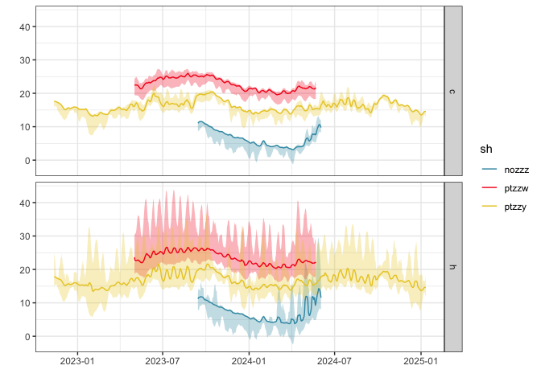
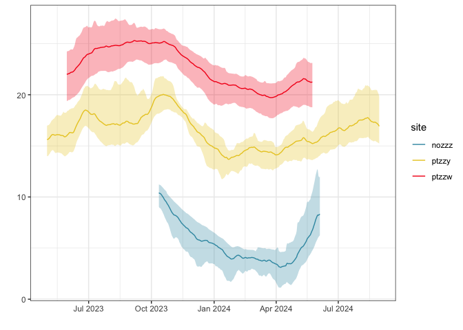

<!-- README.md is generated from README.Rmd. Please edit that file -->

# envlogger

<!-- badges: start -->

<!-- badges: end -->

Functions to handle EnvLogger data, from reading, processing and
plotting.  
If data conforms to the CCTBON naming scheme, additional functionalities
are available.

## Installation

You can install the development version of **envlogger** from
[GitHub](https://github.com/) with:

``` r
# install.packages("devtools")
devtools::install_github("ruiseabra/envlogger")
```

## Load envlogger

``` r
library(envlogger)
```

## Example data

The package **envlogger** comes bundled with example data, including
modified files that exemplify issues that the package’s functions can
handle automatically. Use this dataset to get familiarized with the
package’s capabilities.

``` r
# files included
lapply(env_example(), basename)
#> $log
#> [1] "log_2024-06-05_063724.csv"         "log_2025-01-31_093212.csv"        
#> [3] "log_2024-05-25_095701.csv"         "log_2024-01-12_082832_bad_col.csv"
#> [5] "log_2025-01-14_070601.csv"        
#> 
#> $metadata
#> [1] "improper_file_name_meta.csv"                          
#> [2] "issuemh04a_0434_ef00_4b29_0a-20240116_132500_meta.csv"
#> [3] "4c0000002418fb41_meta.csv"                            
#> 
#> $report
#>  [1] "humidsc01a-0482_ac00_f27d_01-20250506_095113.csv"        
#>  [2] "improper_file_name.csv"                                  
#>  [3] "issuemh04a_0434_ef00_4b29_0a-20240116_132500.csv"        
#>  [4] "issuemc01a-04ad_e500_302d_06-20240525_101116_no_data.csv"
#>  [5] "issuemc02a-04b4_3e00_c90f_0e-20240525_101121_low.csv"    
#>  [6] "issuemh01a-04d3_5e00_b818_02-20240525_095727_gap.csv"    
#>  [7] "issuemh02a-0449_0c00_2310_05-20240525_095804_1970.csv"   
#>  [8] "4c0000002418fb41.txt"                                    
#>  [9] "nozzzmc01a-0425_e500_051e_0b-20240605_063737.csv"        
#> [10] "nozzzmc02a-04da_2800_d33a_0d-20240605_063925.csv"        
#> [11] "nozzzmh01a-04fd_0b00_3805_0e-20240605_064147.csv"        
#> [12] "nozzzmh02a-04a5_bb00_521c_0f-20240605_064246.csv"        
#> [13] "pressmc01b-0405_f000_5411_01-20250131_093703.csv"        
#> [14] "ptzzwmc01a-04ad_e500_302d_06-20240525_101015.csv"        
#> [15] "ptzzwmc02a-04b4_3e00_c90f_0e-20240525_101121.csv"        
#> [16] "ptzzwmh01a-04d3_5e00_b818_02-20240525_095727.csv"        
#> [17] "ptzzwmh02a-0449_0c00_2310_05-20240525_095804.csv"        
#> [18] "ptzzymc01a-04ce_ce00_4114_06-20240112_084047.csv"        
#> [19] "ptzzymc02a-04cb_8f00_e758_05-20240112_083906.csv"        
#> [20] "ptzzymh01a-04dc_6700_dd59_0f-20240112_082904.csv"        
#> [21] "ptzzymh02a-04cb_cc00_1507_0c-20240112_083030.csv"        
#> [22] "ptzzymc01a-04ce_ce00_4114_06-20250114_111522.csv"        
#> [23] "ptzzymc02a-14cb_8f00_e758_05-20250114_111020.csv"        
#> [24] "ptzzymh01a-04dc_6700_dd59_0f-20250114_111804.csv"        
#> [25] "ptzzymh02a-04cb_cc00_1507_0c-20250114_111701.csv"        
#> 
#> $unsupported
#> [1] "unsupported_file_1.csv" "unsupported_file_2.csv" "unsupported_file_3.txt"
#> [4] "670000002f037841.txt"
```

## Read data

Use `read_env()` to import EnvLogger data into R. Supported files
include: \* EnvLogger data report files with data (not just the header)
\* EnvLogger log files \* EnvLogger metadata files (created with
`create_metadata_file()`) \* Other data report files originating from
devices other than EnvLoggers, as long as they are accompanied by an
EnvLogger metadata file with values set for fields required for their
correct interpretation

``` r
# here we use the package's example data, specifically 
#  targeting data from site "nozzz" (a rocky shore in Norway)
env <- read_env(
  env_example("nozzz"), 
  show_progress = FALSE, 
  show_warnings = FALSE, 
  log_summary = TRUE)
```

Logfile data contains a record of all interactions with EnvLoggers. It
is useful mainly for tracing back experimental errors or recovering a
forgotten logger password.

``` r
env$log
#> # A tibble: 9 × 8
#>   time                id         serial            v_log   int   res pass  dev  
#>   <dttm>              <chr>      <chr>             <dbl> <dbl> <dbl> <chr> <chr>
#> 1 2024-06-05 05:39:52 nozzzmc04a 0420 1b00 e501 07   7.3  3600   0.1 1111  armo…
#> 2 2024-06-05 05:41:01 nozzzmc05a 0480 1800 9d55 0b   7.3  3600   0.1 1111  armo…
#> 3 2024-06-05 05:41:49 nozzzmh01a 04fd 0b00 3805 0e   7.3  3600   0.1 1111  armo…
#> 4 2024-06-05 05:42:48 nozzzmh02a 04a5 bb00 521c 0f   7.3  3600   0.1 1111  armo…
#> 5 2024-06-05 05:43:28 nozzzmh03a 04e0 0400 5c02 0b   7.3  3600   0.1 1111  armo…
#> 6 2024-06-05 05:48:16 nozzzmh04a 0464 8b00 205c 03   7.3  3600   0.1 1111  armo…
#> 7 2024-06-05 05:49:51 nozzzmh05a 0410 0100 3404 07   7.3  3600   0.1 1111  armo…
#> 8 2024-06-05 05:50:31 nozzzmc02a 04da 2800 d33a 0d   7.3  3600   0.1 1111  armo…
#> 9 2024-06-05 05:51:35 nozzzmc02a 0425 e500 051e 0b   7.3  3600   0.1 1111  armo…
```

Reports comprise the data collected by each logger. Depending on the
params used, data may be shown separately for each data file, or joined
by serial or even by id.

``` r
env$report
#> # A tibble: 4 × 12
#>   id         serial           type  v_log press hum   data      nrow   min   max
#>   <chr>      <chr>            <chr> <chr> <lgl> <lgl> <list>   <int> <dbl> <dbl>
#> 1 nozzzmc01a 0425 e500 051e … t     7.3   FALSE FALSE <tibble>  6425  -1.8  14  
#> 2 nozzzmc02a 04da 2800 d33a … t     7.3   FALSE FALSE <tibble>  6425  -2.2  15.4
#> 3 nozzzmh01a 04fd 0b00 3805 … t     7.3   FALSE FALSE <tibble>  6425  -3.7  38.8
#> 4 nozzzmh02a 04a5 bb00 521c … t     7.3   FALSE FALSE <tibble>  6425  -4.1  38.8
#> # ℹ 2 more variables: t0 <dttm>, t1 <dttm>
```

## Handling issues and unsupported files

As datasets of environmental data grow larger, the occurrence of data
report files that contain errors or follow different field formats
becomes inevitable. Most errors tend to be benign, meaning that they
hardly impact data quality and mainly just cause programming issues that
prevent their easy and automatic interpretation. Examples of such errors
include the presence of gaps, `NA`s in the time or data fields, or
spurious temperatures outside realistic ranges (-80 °C), which are
indicative of momentary/permanent logger faults. In such cases,
**envlogger** can identify the issue and suggest a correction. Suggested
corrections are only implemented automatically upon explicit command
from the user, as doing otherwise could introduce changes to the data to
which the user would be unaware (very unlikely, but unacceptable). On
the other hand, there are instances when errors are complex and
**envlogger** won’t be able to identify what exactly is wrong. A third
situation involves the importing of data that wasn’t generated by
EnvLoggers, and that therefore follows a different data organization
format.

To handle most of the abovementioned situations, the **envlogger**
package relies on metadata files. Metadata files are companion files -
one per data file with issues - that contain information that ensures
that the data file they are paired with can be properly imported. For
benign errors, those files can be generated automatically by calling
`read_env(..., auto_generate_fixes = TRUE, auto_implement_fixes = TRUE)`.
In that case, if issues are detected that the **envlogger** knows how to
handle, new metadata files are created. Subsequent data imports using
`read_env(apply_fixes = TRUE)` will result in those metadata files being
read and the information they contain being used to correct all issues.
This means that once a metadata file is created, so long that the
metadata file is kept together with the its companion file, the issue(s)
it targets will cease to be reported during any subsequent data
imports - it is “fixed”. For files with different data layout formats, a
metadata file must be created manually with a call to
`metadata_create_file()` and, at a minimum, values for `id`, `skip`,
`time_format`, and `sep_dec_comma` need to be set.

While relying on companion metadata files may seem a cumbersome
approach, it ensures that the original data remains unaltered,
preserving data integrity and guaranteeing that fixes can be
reassessed - and even reversed - at any moment, even many years after.
This aspect is so crucial, that it alone justifies the use of metadatada
files.

``` r
issues <- read_env(env_example("issue"))
#> ℹ found 11 files in 2 folders
#> ✔ files read (n = 7) [5 reports, 2 metadata]
#> ✔ fix details found and applied (n = 2)
#> ℹ quality checks failed by some reports (n = 3/5)
#> ✔ RTC clock drifts corrected
#> ✔ no reports to join by serial
#> ✔ no reports to join by id
#> Warning: ℹ issues detected (total n = 7)
#> ℹ type ?create_metadata_file() to learn more about the issues listed below
#> ℹ access paths to files with unresolved issues using $files_with_issues
#> ℹ access paths to newly created metadata files using $files_created
#>   
#> ✖ issues that remain unresolved (total n = 7)
#> → unsupported/no data files have not be imported
#> → files with quality issues have not be imported (issues must be resolved
#>   first)
#> unsupported_file_1.csv ..............................................
#> (unsupported)
#> unsupported_file_2.csv ..............................................
#> (unsupported)
#> unsupported_file_3.txt ..............................................
#> (unsupported)
#> issuemc01a-04ad_e500_302d_06-20240525_101116_no_data.csv ............ (no data)
#> issuemc02a-04b4_3e00_c90f_0e-20240525_101121_low.csv ................ (min)
#> issuemh01a-04d3_5e00_b818_02-20240525_095727_gap.csv ................ (time gap
#> @ 2023-05-04 03:00:00)
#> issuemh02a-0449_0c00_2310_05-20240525_095804_1970.csv ...............
#> (tmin,time gap neg @ 2023-06-14 23:00:00)
#> 
```

As can be seen, the function `read_env()` provides detailed feedback
about issues present in the data (set `show_warnings` to `FALSE` to
disable that). Crucially, the output also contains the paths to the
files with issues, and that can be used to make the creation of the
metadata files easier.

``` r
# create a metadata file
new_file <- metadata_create_file(
  issues$files_with_issues[1], 
  new_vals = list(id = "new_id")
  )

# metadata_create_file() outputs the path to the new file created
file.exists(new_file)
#> [1] TRUE
```

## Parsing information contained in logger ids

If used in a thoughtful way, logger custom names (hereafter referred as
`ids`) can greatly reduce the difficulty of organizing the data
collected with EnvLoggers, especially for large networks comprising data
from dozens or even hundreds of loggers. While logger ids are restricted
to 10 characters, a lot of important details can be coded into those
ids.

The example data included has been collected using some of the ~3000
EnvLoggers of the CCTBON network (\<www.coastalwarming.com/cctbon\>),
and therefore the custom names are set according to the CCTBON naming
scheme. Specifically, CCTBON names are composed of: \* 5 characters for
site name (2 characters for country, 3 for site); THIS MUST BE UNIQUE
WITHIN THE NETWORK \* 2 characters for microhabitat type (in this case,
one character codes shore height, the other the level of exposure to
solar radiation) \* 3 characters for replicate number (2 digits for
replicate number, 1 character for device replacements)

In the example above we have four loggers from site “nozzz” (no =
Norway + zzz = site ZZZ), all installed at the mid-shore level (m), half
in areas of the shore with maximum local solar exposure (h = hot; we
don’t use north/south because that doesn’t work across hemispheres) and
the other half in crevices and other shaded areas (c = cold). There are
2 replicates in each microhabitat.

When the naming scheme used matches the CCTBON scheme, using the
function `parse_id_cctbon()` generates new columns coding for site,
level, exposure and replicate number. These will be important for
subsequent analyses of the dataset that rely on the grouping of data
based on those attributes.

In alternative, if the naming scheme is different, `parse_id()` provides
a less immediate but more flexible way to parse logger ids.

``` r
# when logger ids follow a different naming scheme, ids can still be parsed
# note the new columns site, mic and rep
# note as well that parse_id acccepts "env" as a list or as a tibble (env$report), 
#  but, in both cases, the output consists only of env$report
parse_id(
  env, 
  div = "1111122333", 
  fields = list(
    site = "fct", 
    mic = c("mc", "mh"), 
    rep = "chr"
    )
  )
#> # A tibble: 4 × 15
#>   id       serial site  mic   rep   type  v_log press hum   data      nrow   min
#>   <chr>    <chr>  <fct> <fct> <chr> <chr> <chr> <lgl> <lgl> <list>   <int> <dbl>
#> 1 nozzzmc… 0425 … nozzz mc    01a   t     7.3   FALSE FALSE <tibble>  6425  -1.8
#> 2 nozzzmc… 04da … nozzz mc    02a   t     7.3   FALSE FALSE <tibble>  6425  -2.2
#> 3 nozzzmh… 04fd … nozzz mh    01a   t     7.3   FALSE FALSE <tibble>  6425  -3.7
#> 4 nozzzmh… 04a5 … nozzz mh    02a   t     7.3   FALSE FALSE <tibble>  6425  -4.1
#> # ℹ 3 more variables: max <dbl>, t0 <dttm>, t1 <dttm>
```

``` r
# however, when logger ids conform to the CCTBON naming scheme, parsing ids is much simpler
# note the new columns site, lvl, exp, rep1 and rep2
(env <- parse_id_cctbon(env))
#> # A tibble: 4 × 17
#>   id       serial site  lvl   exp    rep1 rep2  type  v_log press hum   data    
#>   <chr>    <chr>  <fct> <fct> <fct> <dbl> <chr> <chr> <chr> <lgl> <lgl> <list>  
#> 1 nozzzmc… 0425 … nozzz m     c         1 a     t     7.3   FALSE FALSE <tibble>
#> 2 nozzzmc… 04da … nozzz m     c         2 a     t     7.3   FALSE FALSE <tibble>
#> 3 nozzzmh… 04fd … nozzz m     h         1 a     t     7.3   FALSE FALSE <tibble>
#> 4 nozzzmh… 04a5 … nozzz m     h         2 a     t     7.3   FALSE FALSE <tibble>
#> # ℹ 5 more variables: nrow <int>, min <dbl>, max <dbl>, t0 <dttm>, t1 <dttm>
```

## Adding other bits of information

If there are additional bits of information that may be useful for
subsequent analyses, those can be added to the dataset using
`add_info()`. A typical case is the appending of latlon coordinates.
`add_info()` requires the presence of column names `site`, as
information is added by site.

``` r
env <- add_info(
   env,
   info = data.frame(
       treatment = 1,
       site = "nozzz",
       lat = 65,
       lon = 10
   )
  )
env[, c("id", "site", "lat", "lon", "treatment")]
#> # A tibble: 4 × 5
#>   id         site    lat   lon treatment
#>   <chr>      <chr> <dbl> <dbl>     <dbl>
#> 1 nozzzmc01a nozzz    65    10         1
#> 2 nozzzmc02a nozzz    65    10         1
#> 3 nozzzmh01a nozzz    65    10         1
#> 4 nozzzmh02a nozzz    65    10         1
```

## Inspecting data

The **envlogger** package has built-in features that ensure that data
can be confidently imported and joined together by logger serial and id.
However, it is always good practice to inspect the data and look for
loggers that may have malfunctioned in a way that cannot be detected
automatically (e.g., readings have drifted but remain within a valid
range) or for inconsistencies at the joining points. To make that
process simpler, call `plot_env()` with `dy = TRUE`, as that will
produce an interactive dygraphs plot that can be zoomed and panned.
Also, make sure to use the default `col_by = "sgmnt"`. This will ensure
that data collected by the same logger (i.e., same serial) that is
contained in different files get colored differently, facilitating the
identification and inspection of joining points. After inspecting the
data and confirming that no issues are present, you can confidently
proceed with data analysis.

``` r
env <- read_env(
  env_example("ptzzy"), 
  show_progress = FALSE, 
  show_warnings = FALSE)
env <- tidyr::unnest(env$report, data)
env <- dplyr::filter(env, dplyr::between(t, 
  as.POSIXct("2024-01-11", tz = "UTC"), 
  as.POSIXct("2024-01-14", tz = "UTC"))
  )
```

``` r
plot_env(env, dy = TRUE)
# notice how ids ptzzymh01a and ptzzymc01a are represented by 
#  one green segment until Jan 12, and a purple segment afterwards 
#  (on Jan 12 data was downloaded and the logger memories erased, 
#  while data from that date onwards was downloaded at a later moment, 
#  leading to the entire dataset being contained in two separate files)
```


## Summarising and Visualizing

The main goal of the **envlogger** package is to facilitate the
importing and curating of large sets of EnvLogger data. Nevertheless,
additional tools are provided for quickly summarising and visualizing
large datasets. This is accomplished using the `summarise_env()`
function and the ggplot2 options of `plot_env()`.

``` r
# summarising often requires data at the exact same timestamps
# to have that, we can provide a value for new_interval, which 
#  will result in all data being interpolated to that new time interval
env <- read_env(
  env_example(c("ptzzw", "ptzzy", "nozzz")), 
  new_interval  = 60,
  show_progress = FALSE, 
  show_warnings = FALSE)$report

env <- parse_id_cctbon(env)

# compute daily q10, mean and q90 for each site
env_summarised <- summarise_env(
  env, 
  by_day = TRUE, 
  by_site = TRUE, 
  fun_list = list(
    ymin = function(x) quantile(x, 0.1),
    temp = function(x) mean(x),
    ymax = function(x) quantile(x, 0.9)
      )
  )

plot_env(env_summarised, gg_ribbon = TRUE, col_by = "site")
```



``` r
# apply a rolling monthly average to each stat
env_roll <- summarise_env(
  env, 
  by_day = TRUE, 
  by_site = TRUE, 
  fun_list = list(
    ymin = function(x) quantile(x, 0.1),
    temp = function(x) mean(x),
    ymax = function(x) quantile(x, 0.9)
      ),
  roll_days = 30
  )

plot_env(env_roll, gg_ribbon = TRUE, col_by = "site")
```


